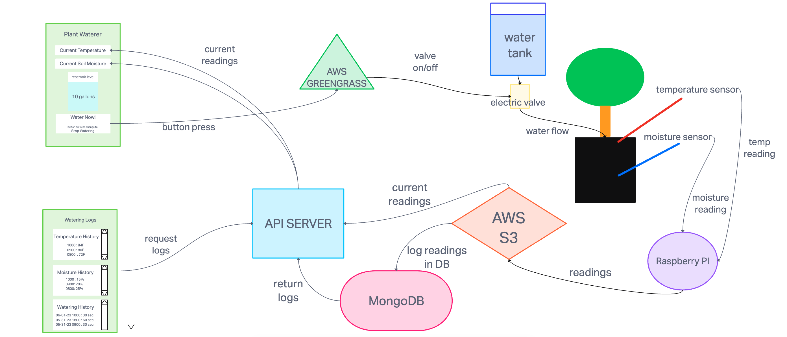
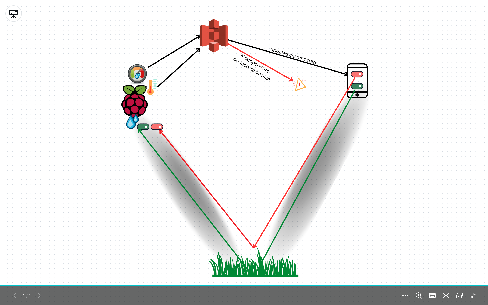
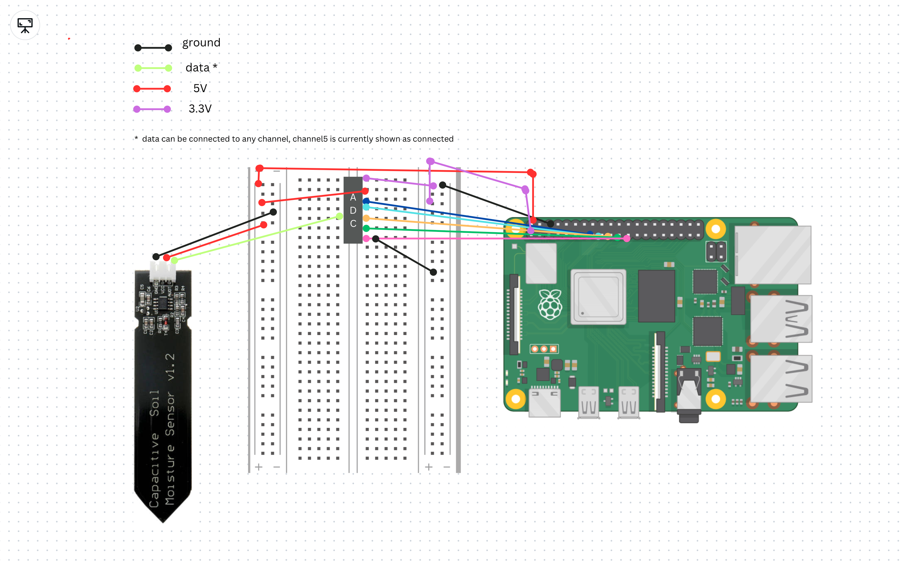
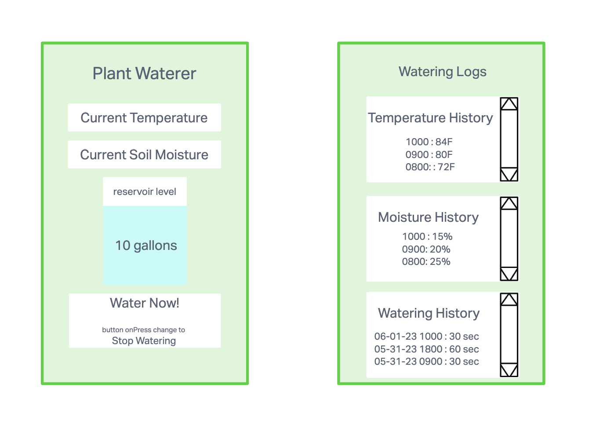

# plant-water-pi

This project aims to create an automatic irrigation system using Raspberry Pi to detect soil moisture levels and control watering accordingly. Additionally, it provides a mobile app interface to monitor and control the irrigation system remotely.

## Features

Soil moisture detection: The Raspberry Pi is equipped with a soil moisture sensor that measures the moisture content of the soil.

Automatic watering: Based on the soil moisture readings, the system automatically triggers the irrigation system to water the plants when the moisture level falls below a certain threshold.

Mobile app integration: The irrigation system can be monitored and controlled remotely using a mobile app. The app provides real-time data on soil moisture levels and allows users to adjust irrigation settings as needed.

## Whiteboards

## Task Tracker Board (Meistertask)

[https://www.meistertask.com/app/project/oOHOmVk2/clueless-caterpillars](https://www.meistertask.com/app/project/oOHOmVk2/clueless-caterpillars)

## Hardware Requirements

To set up the project, you will need the following hardware components:

### Raspberry Pi (any model with GPIO pins)

Soil moisture sensor
Relay module
Water pump/solenoid valve
Jumper wires
Power supply for Raspberry Pi and water pump/valve
Optional: Enclosure for Raspberry Pi and sensor

## Software Requirements

The following software components are required for this project:

Raspbian OS or any other compatible operating system for Raspberry Pi
Python 3.x
Node
React Native

[Software Requirements Document](./requirements.md)

## Installation

1. Connect the soil moisture sensor to the Raspberry Pi's GPIO pins as per the sensor's documentation.
2. Connect the relay module to the Raspberry Pi's GPIO pins, ensuring proper wiring between the relay, water pump/valve, and power supply.
3. Install the required dependencies and libraries on the Raspberry Pi by following the instructions provided by the sensor and relay module manufacturers.
4. Clone or download the project repository from GitHub: [insert GitHub link]
5. Set up the mobile app development environment following the framework's documentation and project-specific instructions.
6. Install the necessary dependencies for the mobile app by running the appropriate package manager commands.
7. Configure the mobile app to connect to the Raspberry Pi's IP address or domain name.

## Usage

1. Power on the Raspberry Pi and ensure it is connected to the network.
2. Launch the mobile app on your device and establish a connection with the Raspberry Pi.
3. The app will display real-time soil moisture readings and allow you to adjust the irrigation settings.
4. When the soil moisture falls below the set threshold, the Raspberry Pi triggers the relay module, activating the water pump/valve to irrigate the plants.
5. The app will provide feedback on the irrigation process and notify you of any issues or irregularities.

## Customization

Feel free to customize and extend the project according to your specific requirements. Some potential enhancements include:

- Adding multiple soil moisture sensors for different areas or plant types.
- Implementing a scheduling system to water the plants at specific times or intervals.
- Integrating weather data to adjust watering based on precipitation forecasts.
- Adding additional sensors for monitoring temperature, humidity, or light levels.
- Implementing data logging and analytics to track plant growth and irrigation patterns.

## Troubleshooting

If you encounter any issues or errors during the installation or usage of the project, consider the following:

1. Check the wiring connections between the Raspberry Pi, sensor, relay module, and water pump/valve.
2. Ensure that all the required dependencies and libraries are correctly installed on the Raspberry Pi.
3. Verify that the mobile app is configured with the correct IP address or domain name of the Raspberry Pi.
4. Monitor the system logs on the Raspberry Pi for any error messages or warnings.
5. If the problem persists, consult the project's documentation, seek assistance from the community or raise an issue on the GitHub repository for further support.

## License

This project is licensed under the MIT License

### Team Members

[Daniel Yoon](https://www.linkedin.com/in/dansyoon/)
[Miranda Lu](https://www.linkedin.com/in/mirandalu2022/)
[Kawika Miller](https://www.linkedin.com/in/kawikamiller/)
[Nate Brown](https://www.linkedin.com/in/nate-brown-dev/)
[Kameron Watts](https://www.linkedin.com/in/kamwatts/)
